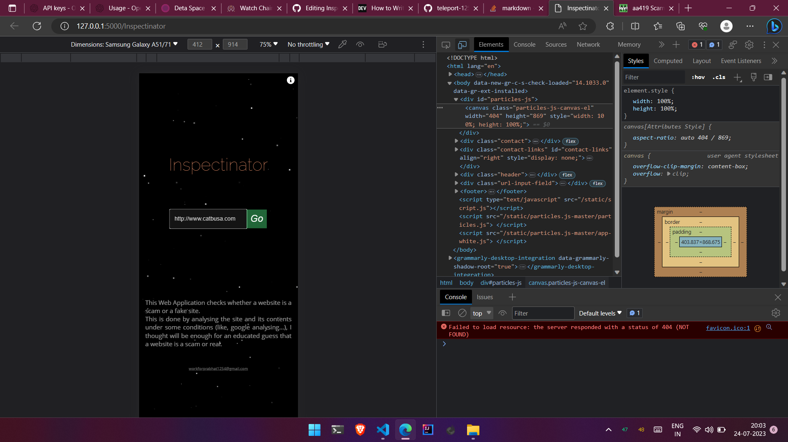
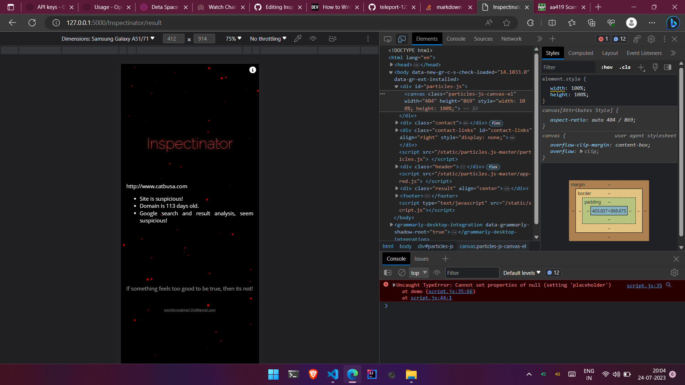

# Inspectinator
_Scams_ and _Phishing_ attacks are common these days.  
Inspectinator inspects URLs and Domains for scams.  

The site is analyzed based on the following aspects or parameters:  
    - are too many **hyphens** in the domain  
    - *google analysis*  
    - *whois* data check  
    - *tld* check  

### __Home page__  

### __Result page__  

[__Demo video__  ](https://github.com/teleport-1254/Inspectinator/blob/main/demo/vid.mp4)

---
## Requirements:  
- Python 3.9  
- MySQL 8.0  
---

## Setup:  
Install all required python libraries by  
`pip install -r requirements.txt`  
Run MySQL queries in `table-query.txt`  
Change `mysql.connector` configs in `isscam.py`  
Run `app.py`  
Open browser and navigate to `http:127.0.0.1:5000/`
